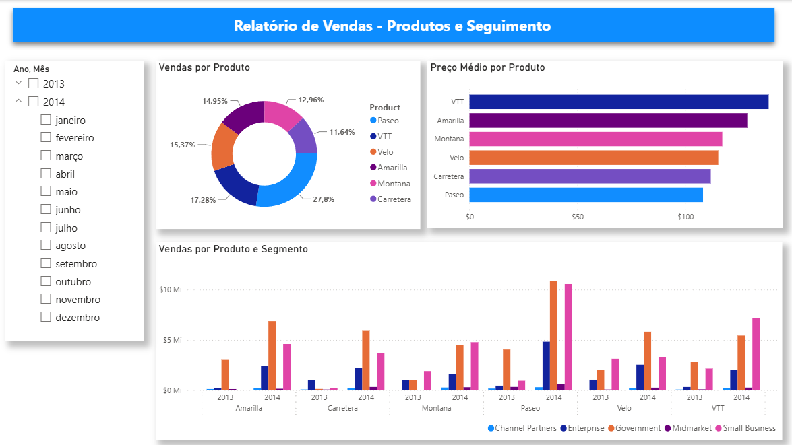
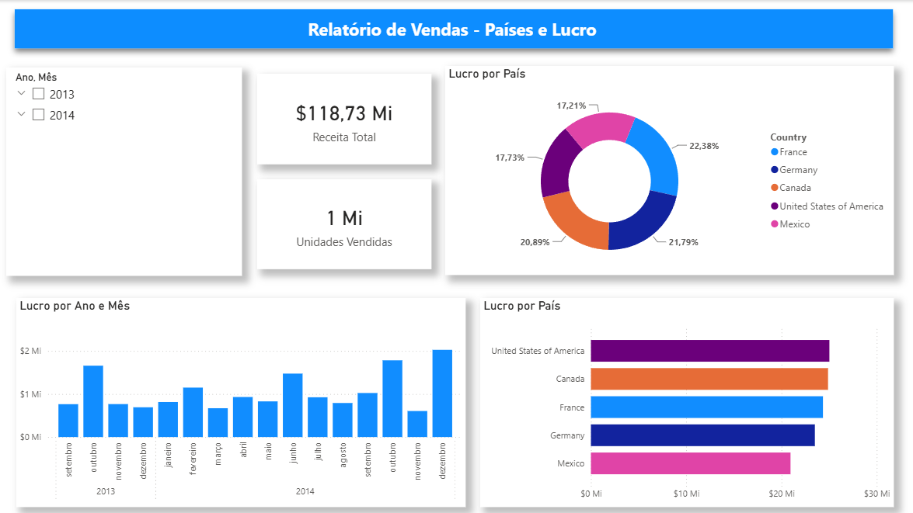
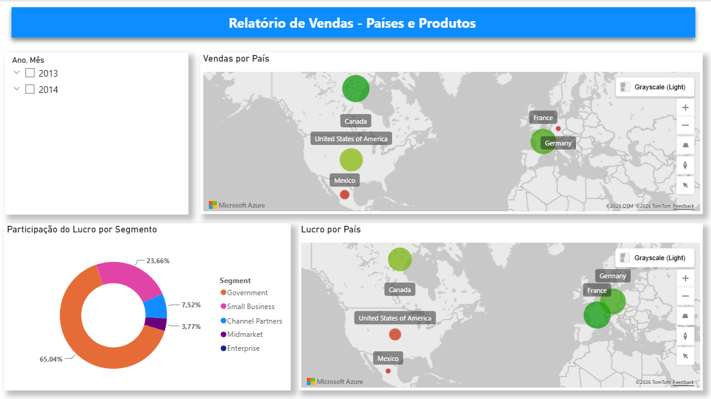

# Power BI Storytelling - Financials

Dashboard desenvolvido durante o curso **Power BI Analyst** da DIO utilizando o dataset **Financials** da Microsoft.

## Objetivo

Desenvolver dashboards interativos aplicando conceitos de:

- Storytelling
- Visualização de dados
- KPIs
- Azure Maps
- Power BI Service
- PowerPoint Add-in

## Tecnologias

- Power BI Desktop
- Power BI Service (Fabric)
- Microsoft PowerPoint
- GitHub

## Dashboards

### Produtos

### Lucro

### Países

## Arquivos

- financials.pbix
- Microsoft-Power-BI-Storytelling.pptx

## Competências Desenvolvidas

- Modelagem de dados
- Storytelling
- Visualização de dados
- Azure Maps
- Publicação no Power BI Service
- Integração entre Power BI e Microsoft PowerPoint

## Observações

Este projeto foi desenvolvido durante a formação Power BI Analyst da DIO utilizando o dataset Financials da Microsoft. Durante o desenvolvimento foram realizadas pequenas adaptações na organização dos visuais, nomenclatura e layout em relação ao projeto proposto em aula.
